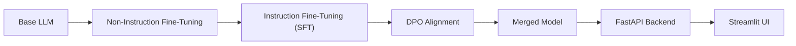

# Customer Support AI Assistant using Unsloth, LoRA, QLoRA and DPO

## Project Overview

This project demonstrates the complete workflow of building a domain-specific AI assistant by fine-tuning an open-source Large Language Model using **Unsloth**.

The project transforms a general-purpose LLM into a **Customer Support AI Assistant** capable of answering customer service queries in a professional, helpful, and context-aware manner.

The complete workflow includes:

- Non-Instruction Fine-Tuning
- Instruction Fine-Tuning (SFT)
- Direct Preference Optimization (DPO)
- Hugging Face Model Publishing
- FastAPI Backend
- Streamlit Web Application

---

# Domain Selected

**Customer Support**

The assistant answers customer support questions such as:

- Refund requests
- Order tracking
- Shipping information
- Order cancellation
- Payment issues
- Account support
- Product information

---

# Business Problem

Customer support teams receive thousands of repetitive customer queries every day.

Manual handling increases:

- Response time
- Operational costs
- Human workload
- Customer waiting time

This project demonstrates how a fine-tuned LLM can automate common customer support interactions while maintaining high-quality responses.

---

# Dataset

Three datasets were prepared.

## Non-Instruction Dataset

Used for domain adaptation.

Contents include:

- Customer support conversations
- FAQs
- Product documentation
- Customer policies

---

## Instruction Dataset

Used for Supervised Fine-Tuning (SFT).

Format:

```json
{
 "instruction":"...",
 "input":"...",
 "output":"..."
}
```

Example topics:

- Refunds
- Orders
- Shipping
- Product questions
- Payment issues

---

## Preference Dataset

Used for Direct Preference Optimization.

Each record contains:

- Prompt
- Preferred answer
- Rejected answer

This teaches the model to generate more helpful and professional responses.

---

# Base Model

Base Model:

**unsloth/Llama-3.2-3B-Instruct-unsloth-bnb-4bit**

Reasons for choosing this model:

- Lightweight
- Optimized for Unsloth
- Fast training
- QLoRA compatible
- Excellent instruction-following ability

---

# Non-Instruction Fine-Tuning

Objective:

Continue pretraining the model on customer support domain text.

Benefits:

- Better domain knowledge
- Better terminology understanding
- Improved response quality

Notebook:

```
notebooks/non_instruction_finetuning.ipynb
```

---

# Instruction Fine-Tuning (SFT)

Objective:

Teach the model to answer customer support questions in an instruction-following format.

The model was fine-tuned using LoRA and QLoRA techniques through the Unsloth framework.

Notebook:

```
notebooks/instruction_finetuning.ipynb
```

---

# Direct Preference Optimization (DPO)

Objective:

Improve response quality by learning preferred responses.

DPO improves:

- Helpfulness
- Professional tone
- Safety
- Clarity
- Reduced hallucinations

Notebook:

```
notebooks/dpo_alignment.ipynb
```

---

# LoRA / QLoRA Configuration

The project uses **LoRA** and **QLoRA** for efficient fine-tuning of the base model.

Training was performed using the **Unsloth** framework with:

- 4-bit quantization (QLoRA)
- LoRA adapters
- Mixed precision training
- Supervised Fine-Tuning (SFT)
- Direct Preference Optimization (DPO)

The exact training hyperparameters are documented in the training notebooks.

---

# Hugging Face Model

Fine-tuned LoRA Adapter:

**https://huggingface.co/MarreeJ/customer-support-merged**

---

# Backend

Framework:

- FastAPI

Features:

- Loads the fine-tuned model
- REST API
- JSON request/response
- Model inference

Example endpoint:

```
POST /chat
```

Example Request

```json
{
 "question":"Where is my refund?"
}
```

Example Response

```json
{
 "answer":"Please provide your order ID so I can check the refund status."
}
```

---

# Frontend

Framework:

- Streamlit

Features:

- Chat interface
- Chat history
- FastAPI integration
- Responsive UI

---

# Project Structure

```
customer-support-chatbot/

│
├── backend/
│
├── frontend/
│
├── notebooks/
│   ├── non_instruction_finetuning.ipynb
│   ├── instruction_finetuning.ipynb
│   ├── dpo_alignment.ipynb
│   └── merge_dpo_model.ipynb
│
├── reports/
│   ├── base_model_evaluation.md
│   ├── sft_model_comparison.md
│   ├── final_evaluation.md
│   └── fine_tuning_explanation.md
│
├── README.md
├── requirements.txt
└── LICENSE
```

---

# Training Screenshots

Training screenshots include:

- Non-Instruction Fine-Tuning
- SFT Training
- DPO Training
- Hugging Face Upload
- FastAPI Testing
- Streamlit Interface

---

# Before vs After Comparison

| Stage | Result |
|--------|--------|
| Base Model | Generic customer support responses |
| SFT Model | Domain-aware responses |
| DPO Model | More helpful, professional, and context-aware responses |

Example

Question:

```
Where is my refund?
```

Base Model:

Provides a generic response.

SFT Model:

Requests the order ID and explains the refund process.

DPO Model:

Provides a professional response, requests the order ID, explains refund timelines, and offers additional assistance.

---

# Final Observations

The project successfully demonstrates the complete lifecycle of domain-specific LLM fine-tuning.

Major improvements include:

- Better customer support knowledge
- Improved instruction following
- More professional responses
- Reduced hallucinations
- Better conversational quality

---

# Challenges Faced

During development, the following challenges were encountered:

- Preparing high-quality datasets
- Fine-tuning with limited GPU resources
- Managing LoRA adapters
- Uploading models to Hugging Face
- Integrating FastAPI with Streamlit
- Deploying the backend using RunPod and exposing it with ngrok

---

# Future Improvements

Possible future enhancements include:

- Retrieval-Augmented Generation (RAG)
- Multi-turn conversation memory
- CRM integration
- Order tracking APIs
- Multilingual customer support
- Permanent cloud deployment
- Automated evaluation benchmarks

---

# # Technologies Used

## Programming Language
- Python

## AI / Machine Learning
- Unsloth
- Hugging Face Transformers
- PyTorch
- PEFT (LoRA)
- TRL (DPO Trainer)

## Fine-Tuning Techniques
- LoRA
- QLoRA
- Supervised Fine-Tuning (SFT)
- Direct Preference Optimization (DPO)

## Backend
- FastAPI

## Frontend
- Streamlit

## Model Hosting
- Hugging Face Hub

## Development & Deployment
- GitHub
- RunPod
- ngrok


````markdown
## 🏗️ Architecture Diagram


---

# Author

**Marree Jachaak**

Customer Support AI Assistant developed using Unsloth, LoRA, QLoRA, Supervised Fine-Tuning (SFT), and Direct Preference Optimization (DPO).